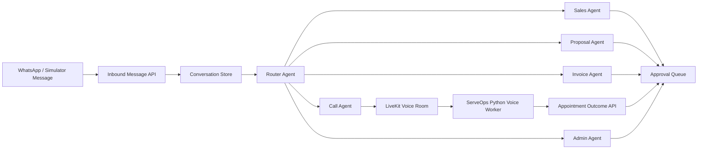

# ServeOps AI — Hackathon Submission Pack

## Deadline

Submit before **14 August 2026, 6:00 PM SGT**.

## Project Name

**ServeOps AI — AI Operating Team for SMEs**

## Track

CodeBuddy Track: **Business Agent**

## One-Line Pitch

ServeOps AI turns WhatsApp customer messages into a coordinated AI operating team that prepares replies, proposal decks, invoices, appointment calls, and follow-up tasks for SME owners.

## Project Description

SME owners in Singapore often run daily operations from WhatsApp. Customer inquiries, service requests, pricing questions, invoice requests, and appointment scheduling all arrive in one messy channel. Most SMEs do not have a CRM, sales ops team, invoice assistant, or admin coordinator. The owner becomes the bottleneck.

ServeOps AI solves this by giving SMEs an AI operating team connected to their WhatsApp workflow. When a customer sends a message, ServeOps understands the request, estimates urgency and value, and routes work to specialized agents. The Sales Agent drafts the customer reply or quote, the Proposal Agent generates a pitch deck, the Invoice Agent creates an invoice draft, the Call Agent can confirm details through a LiveKit voice call, and the Admin Agent creates follow-up tasks. Every output is stored as an approval item so the owner stays in control before anything is sent.

The demo uses an F&B business as the main scenario, but the product is configurable for any SME. The owner can define business name, industry, service catalog, pricing, payment terms, availability, and brand tone. Then any simulated WhatsApp customer message can generate business-specific deliverables in real time.

## Target Users

Small and medium business owners who manage customer operations through WhatsApp:

- F&B catering businesses
- Tuition centres
- Renovation contractors
- Salons and spas
- Clinics
- Repair and servicing businesses
- Agencies and consultants

## Core Problem

SME owners lose time and revenue because customer messages require many manual back-office steps:

- Understand what the customer wants
- Decide whether it is urgent or valuable
- Draft a reply
- Prepare a quote or proposal
- Generate an invoice
- Schedule a call or appointment
- Create follow-up tasks
- Remember to send everything

This is usually done manually, late, or inconsistently.

## Solution

ServeOps AI creates a WhatsApp-first operating layer for SMEs.

Flow:

1. Owner sets up business profile and services.
2. Customer sends a WhatsApp-style message.
3. AI router identifies intent, urgency, missing information, and estimated value.
4. Specialized agents create business deliverables.
5. Owner reviews everything in the approval queue.
6. Owner approves, edits, or rejects.
7. Proposal, invoice, reply, call outcome, and tasks are ready for action.

## AI Agents

| Agent | Role |
| --- | --- |
| Router Agent | Understands message intent, urgency, value, missing info, and required agents |
| Sales Agent | Drafts WhatsApp reply and quote |
| Proposal Agent | Creates proposal/pitch deck content |
| Invoice Agent | Generates invoice draft from customer request and service catalog |
| Call Agent | Starts a LiveKit voice call to confirm details and book appointment |
| Admin Agent | Creates follow-up tasks and owner reminders |

## Technical Architecture

Stack:

- Next.js app
- Prisma + PostgreSQL
- OpenRouter-compatible LLM calls
- LiveKit for real-time call room
- Deepgram STT
- ElevenLabs TTS
- Python LiveKit voice worker
- WhatsApp simulator for demo
- WAHA / Meta WhatsApp Business API path for production

## CodeBuddy Product Sharing Paragraph

I used CodeBuddy as the primary coding partner to build ServeOps AI. CodeBuddy helped plan the product flow, inspect the existing codebase, implement the WhatsApp simulator, add configurable SME business setup, generate proposal and invoice views, debug dynamic pricing, and integrate a LiveKit-based call agent adapted from an existing Warmline voice agent. The most useful part was using CodeBuddy to move from product idea to working full-stack implementation quickly: API routes, UI states, agent pipeline logic, build validation, and git commits were handled through iterative natural-language development.

## Quantifiable Impact

For a typical SME owner, ServeOps can reduce customer-operation handling from 20-40 minutes per enquiry to under 3 minutes of review:

- Faster reply preparation
- Fewer missed leads
- Consistent pricing from service catalog
- Faster invoice generation
- Better appointment follow-up
- Owner remains in control through approvals

## Submission Checklist

- Project title: **ServeOps AI — AI Operating Team for SMEs**
- Track: **Business Agent**
- Project description
- Screenshots
- 3-5 minute demo video link, Loom/YouTube/Google Drive
- Product Sharing paragraph about CodeBuddy
- Project link, if deployed
- GitHub/repo link, if allowed
- Pitch deck, for pitch round
- Backup screen recording

## Judging Criteria To Emphasize

- **AI Innovation, 30%:** Multi-agent operating team, not a chatbot.
- **Technical Excellence, 20%:** Dynamic agent pipeline, generated docs, invoice/deck routes, LiveKit call agent.
- **User Experience & Demo, 25%:** WhatsApp-first mobile simulator, approval queue, clean owner workflow.
- **Business Value, 25%:** Real SME pain point, clear commercial path, works beyond F&B.

## Loom Demo Script

Target length: **3 to 5 minutes**.

### 0:00-0:25 — Opening

Hi, I’m presenting ServeOps AI, an AI operating team for SMEs. Most small business owners in Singapore run their customer operations through WhatsApp. But every message creates hidden work: reply, quote, proposal, invoice, appointment scheduling, and follow-up. ServeOps AI turns that single WhatsApp message into coordinated business deliverables.

### 0:25-0:55 — Problem

SMEs usually do not have a CRM or sales operations team. A customer asks for pricing or an appointment, and the owner has to manually understand the request, prepare a quote, create an invoice, schedule a call, and remember the follow-up. This slows down response time and causes missed revenue.

### 0:55-1:25 — Business Setup

Here the owner configures the business. For the demo, I’m using an F&B business, but this can work for tuition centres, salons, renovation contractors, repair services, clinics, or agencies. The owner defines the business name, industry, services, pricing, payment terms, availability, and tone. This makes the AI outputs specific to the SME, not generic.

### 1:25-2:05 — WhatsApp Message

Now I’ll simulate a customer message from WhatsApp. The customer is asking for a service, pricing, scheduling, and invoice support. When I send this message, ServeOps stores the conversation and sends it into the AI agent pipeline.

### 2:05-2:40 — AI Pipeline

The Router Agent understands the intent, urgency, estimated value, and missing information. Then it routes the work to the right agents. The Sales Agent prepares the WhatsApp reply and quote. The Proposal Agent creates the pitch deck. The Invoice Agent creates the invoice draft. The Admin Agent creates follow-up tasks.

### 2:40-3:20 — Generated Deliverables

Here are the generated business deliverables. We have a reply or quote, a proposal deck, an invoice draft, call plan, and tasks. Each one is stored as an approval item. The owner can open the pitch deck and invoice before sending anything to the customer.

### 3:20-3:55 — Call Agent

For higher-intent customers, the owner can start the Live Voice Call Agent. This uses a LiveKit voice room and a Python voice worker adapted from my Warmline call agent. The call agent uses the WhatsApp enquiry, service details, pricing, payment terms, and available slots to confirm the customer’s request and book the next step. The booking outcome goes back into ServeOps as an approval item.

### 3:55-4:25 — Owner Control

ServeOps is not blindly sending messages. The owner stays in control through the approval queue. The AI prepares the operational work, but the SME owner approves before the final customer action.

### 4:25-4:50 — CodeBuddy Reflection

I built this using CodeBuddy as my AI coding partner. CodeBuddy helped me design the flow, implement the WhatsApp simulator, build the multi-agent pipeline, generate proposal and invoice views, fix dynamic pricing, and integrate the LiveKit call agent. It helped me move from idea to working demo very quickly.

### 4:50-5:00 — Closing

ServeOps AI is an AI operating team for SMEs: WhatsApp in, business deliverables out, with owner approval. Thank you.

## Demo Recording Tips

- Keep the browser zoom at 80-90% if needed.
- Start from the Live Demo page.
- Use one clean scenario only.
- Do not show too many menus.
- Open the generated deck and invoice in new tabs before recording if possible.
- If LiveKit env is not connected, say: “The voice worker integration is implemented; this local environment is showing the setup fallback.”
- Keep the story focused on one customer becoming one set of business deliverables.
